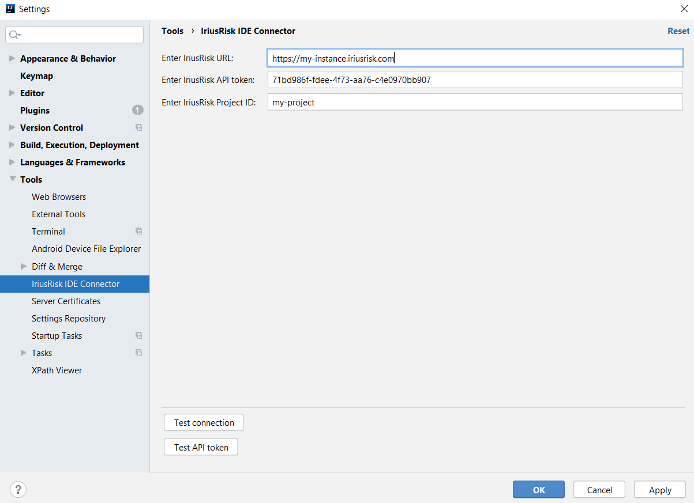
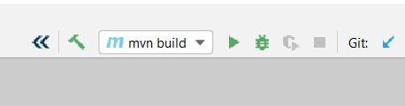
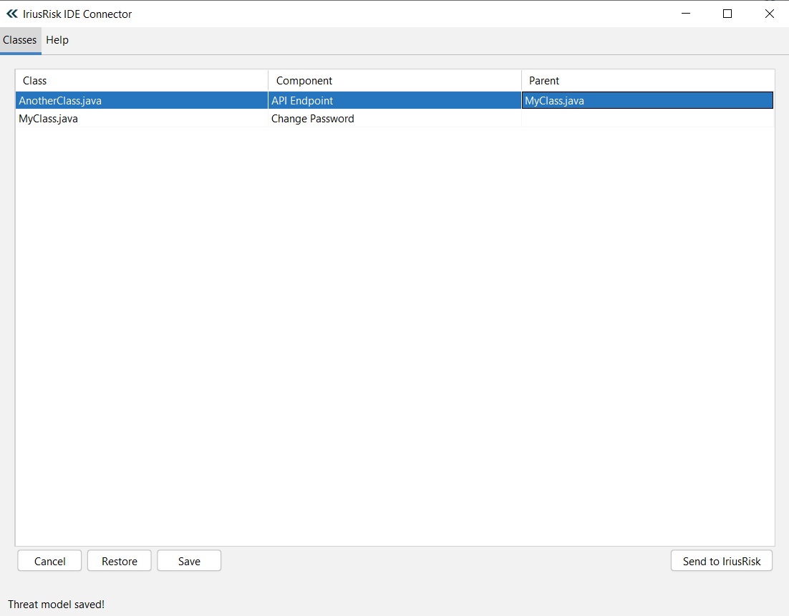
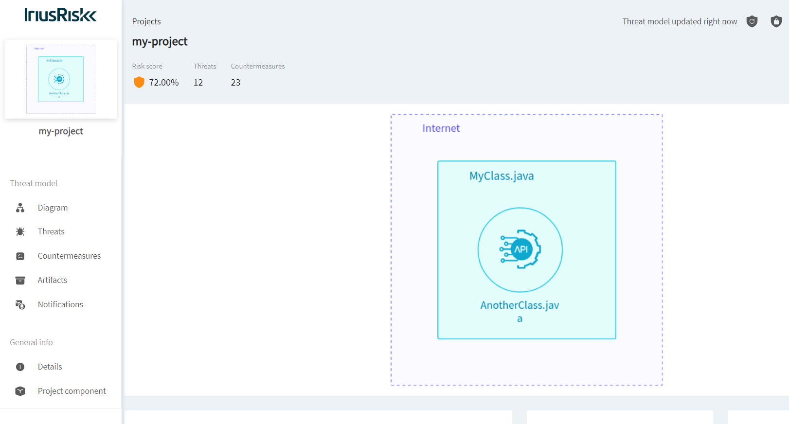

# IriusRisk IDE Connector

Update a threat model in IriusRisk based on actual code functionality to create a class-based threat model.

### How to install

This plugin is not in the Intellij Marketplace, so you will have to install the plugin manually.

* Get the plugin archive from the "releases" folder.
* Press Ctrl+Alt+S to open the IDE settings and select Plugins.
* On the Plugins page, click The Settings button and then click Install Plugin from Disk….
* Select the plugin archive file and click OK.
* Click OK to apply the changes and restart the IDE if prompted.

These instructions can be found here: https://www.jetbrains.com/help/idea/managing-plugins.html

### How to use

First thing is to set the IriusRisk URL, api token and project in Settings -> Tools -> IriusRisk IDE Connector.
You should have created an empty project in IriusRisk before doing this and have access to the API.

Test the connection if needed to ensure Intellij can connect to IriusRisk:

Press the IriusRisk button next to Build/Run/Debug to open the main window:

Use the Class tab to set a functional component for each class file.
Save your changes before sending the threat model to IriusRisk:

Threat model will be displayed in your instance of IriusRisk:

Alternatively, an XML file will be created in the project root.

#### Disclaimer

The following list contains some details that users should be aware of:

* It is possible to create new components in a threat model if the class wasn't already in it
* It is **not** possible to modify the component that has already been assigned to a class
* It is **not** possible to modify the parent of a class
* It is **not** possible to delete a class from an existing threat model
* The parent class must be written by hand
* Functional components are hardcoded
* The UI takes around 2-3 seconds to load. Tested with +9000 classes in one project
* The process of uploading the threat model to IriusRisk can be a bit slow
* For now, it only works for Java and Groovy files
* If things get weird check the following file and ensure that all the information is correct, or just remove it and let the plugin create the file again:
  * Windows: %APPDATA%/JetBrains/<YourIntelliJVersion>/options/iriusrisk-ide-connector.xml
  * Linux: ~/.config/JetBrains/<YourIntelliJVersion>/options/iriusrisk-ide-connector.xml

If you are using this Intellij plugin to create threat models in IriusRisk, there is an important limitation you should be aware of. The plugin currently does not allow users to modify existing threat models to update or delete components without manual actions.

This limitation, which is expected to be solved once IriusRisk releases the APIv2, can be frustrating if you need to make changes to an existing threat model, as you will need to create a new threat model from scratch and transfer over any relevant information. 

This can be time-consuming, especially if you have already invested significant effort in creating the original threat model.

If you anticipate needing to make changes to your threat models frequently, or if you already have existing threat models that you need to modify, then you may want to consider using IriusRisk directly to create and manage your threat models. 

However, if you are primarily focused on creating new threat models from scratch, then the Intellij plugin can be a useful tool for quickly creating and visualizing your security architecture. Just be aware of the plugin's limitations and plan accordingly to avoid any potential frustration or wasted effort.

### Use case

1. A team is working on an application
2. They want to perform a threat model based on the code that they have
3. Some members of the team are working on the UI, others on the login process, etc.
4. Each group creates their own threat model based on the classes that they are working on
5. Each group now has a threat model that identifies a process in the application that can be secured by design
6. The team lead can create project components from those threat models to build the threat model of the entire application

### How to dev

Import this repository into Intellij IDEA. Run with Gradle/Tasks/intellij/runIde to run an Intellij instance that can be debugged.

#### TODOs:

Here's a list of things that would be nice to have:

* Change process to update the threat model once the API allows to CRUD components (APIv2)
* Download functional components directly from instance, remove hardcoded values (APIv2)
* Ensure that class names cannot be repeated (absolute paths could be used as IDs)
* Create batch functions to set components to multiple classes at the same time based on name or path
* All elements are set in the Internet trustzone by default (as a developer I don't really care)
* Add dataflows depending on related components
* Performance improvements in general
* An option to choose whether to create an XML file or to upload it directly to IriusRisk

PRs and ideas are welcome!
